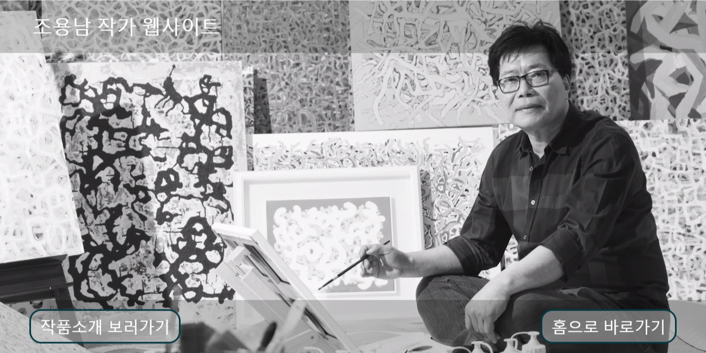
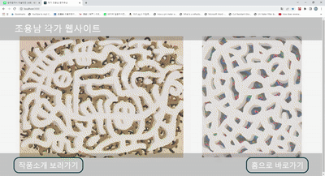
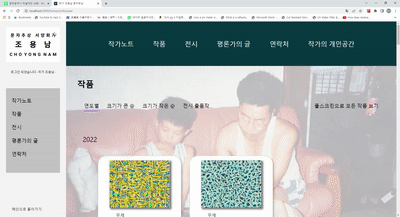
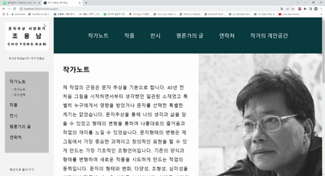
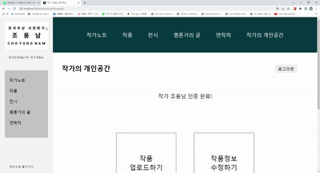
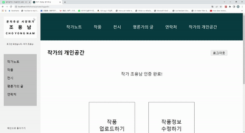
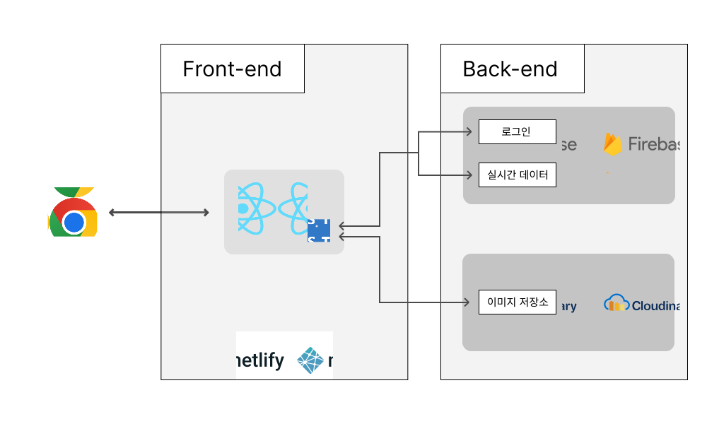

# Cho Yong Nam Official Art Website

https://cho-yong-nam-artist.netlify.app

This is a website for presenting Artist Cho Yong Nam's works via online.

Best by min-width: 1190 px, max-width: 2000 px 

## License and Copyrights
 
Any use of website's asset without permission is rejected. 

All of Cho Yong Nam's works and assets related to his works are entitle to protection under Gwangju Fine Arts Association.

Copyright © 2023- Artist Cho Yong Nam

## Contacts

Artist Cho Yong Nam : d33cho@hanmail.net

Designed and Published by Cho Jae Sin: 1005jsc@naver.com

---

   
   
  
   
   
  <h1>조용남 작가 웹사이트</ㅔ>
   

   
   

## 목차

1. [**웹 서비스 소개**](#1)
1. [**주요 기능**](#2)
1. [**기술 스택**](#3)
1. [**프로젝트 구성도**](#4)
1. [**개발기간**](#5)
1. [**웹사이트 핵심가치 설정 및 디자인 방향성 결정**](#6)
1. [**개발과정**](#7)

 

## 웹 서비스 소개
 

- 웹사이트 방문객들에게 조용남 작가님을 소개하고 작가님의 작품들을 고화질의 이미지로 전시합니다. 
- 작품이미지, 작품에 관련된 데이터, 전시회등을 작가님이 손수 업로드 또는 수정할 수 있습니다.

 

## 주요 기능

 

### To Visitors

 

 <table>
	<tr>
	    <td width="120px" align="center">작가소개</td>
	    <td >'작가노트', '작가연혁', '평론가의 글', '연락처'등 작가님에 대한 정보를 얻을 수 있습니다. </td>
	    <td> </td>
	</tr>
    <tr>
	    <td rowspan="4" align="center">작품관람</td>
	    <td>작가의 작품들을 고화질로 감상하실 수 있습니다. 본 웹사이트에 사용된 이미지들은 고화질로써 원화의 감동을 최대한 살리려 노력하였습니다.</td>
	    <td></td>
	</tr>
	<tr>
	    <td>연도별, 크기별, 전시출품별등의 기준으로 작품들을 정리해 보다 빠르게 원하는 작품을 찾을 수 있게 만들었습니다.</td>
	    <td></td>
	</tr>
	<tr>
	    <td>풀스크린으로 작품들을 감상하실 수 있습니다. </td>
	    <td></td>
	</tr>
	<tr>
	    <td>확대하여보기 기능으로 작품의 세밀한 디테일까지 확인 하실 수 있습니다.</td>
	    <td></td>
	</tr>
    <tr>
	    <td align="center">전시회 열람</td>
	    <td >'작가노트', '작가연혁', '평론가의 글', '연락처'등 작가님에 대한 정보를 얻을 수 있습니다. </td>
	    <td> </td>
	</tr>
  </table>

 

### To Artists

 

 <table>
    <tr>
	    <td colspan="3" align="center">'작가의 개인공간'에서만 가능한 서비스입니다. 작가만이 로그인을 통해 입장이 가능합니다.</td>
	</tr>
	<tr>
	    <td width="130px" align="center">작품 업로드</td>
	    <td >작가의 작품이미지 및 작품정보를 웹사이트에 업로드합니다</td>
	    <td> </td>
	</tr>
	<tr>
	    <td align="center">작품정보수정 </td>
	    <td >작품의 기존데이터를 수정할 수 있습니다</td>
	    <td> </td>
	</tr>
	<tr>
	    <td width="76px" align="center">전시회업로드</td>
	    <td >전시회 포스터, 전시회 정보, 전시회 출전작품등의 데이터 등을 업로드 할 수 있습니다.</td>
	    <td> </td>
	</tr>
    
  </table>

 

## 기술 스택
 

|  |  |  |
| :----------------------------------------------------------------------------------------------------------------------------: | :--------------------------------------------------------------------------------------------------------------------------: | :-----------------------------------------------------------------------------------------------------------------------------: |
|                                                             HTML5                                                              |                                                             CSS3                                                             |                                                           TypeScript                                                            |

|  |  |  | 
| :----------: | :--------------: | :-----------: | 
| React                                                               |                                                         Styled-Component                                                         |                                                   React-Router|                                                                 

|  |  | 
| :----------: | :--------------: |  
| Firebase|Cloudinary|                                                                             

 

 

## 프로젝트 구성도
 

|                                   아키텍처(Architecture)                                   |
| :----------------------------------------------------------------------------------------: |
|  |

 

## 개발기간
 

|디자인 및 에셋 준비기간| 21.12.20 ~ 22.01.23 (35일)|
|:--:|:--:|
|코딩기간| 22.01.24 ~ 22.04.01 (68일)|
|**총 기간**| **21.12.20 ~ 22.04.01 (103일)**|

 

 

## 웹사이트 핵심가치 설정 및 디자인 방향성 결정
 

1. 첫 개발 앱으로 '미술작가 웹사이트'를 만들기로 결심

2. 어떤 니즈를 충족시킬 것인가에 대한 고찰

	- 디자인 적인 면: 본 웹페이지를 제작하기 위해 이미 시중에 나와있는 미술작가 웹사이트들을 여러 참고 해본 결과 종합적으로 아쉬웠던 점을 나 혼자 나름대로 정리해 보았다. 작품사진들이 고화질이지 못해 전달력이 떨어진 경우, 작품의 예술적 가치를 관객들에게 전달하는데 집중하기 보단 투자, 매매와 같은 상업적 가치에 치중하고 있는 웹사이트들(특히 갤러리들이 만든 웹사이트), 그 중 가장 아쉬웠 경우는 작가의 매력과 개성이 잘 느껴지지 않았던 경우들이였다. 독창성, 심미성이 그 어떤 종류의 웹사이트 보다 더 잘 드러나있어야 하는데 그 부분이 두드러지지가 않아보여서 많이 안타까웠다. 이번에 만들 웹사이트는 **작가중심, 작가의 개성이 물씬 느껴지는 웹사이트였으면 좋겠다**는 생각을 하였다. 
	
	
	
	- 기능적인 면: 아날로그 분야는 강하지만, 디지털 분야에 익숙하지 않으신 작가님들이 많이 계신다. 그분들은 보통 실물의 작품을 얼마나 잘 만들것인가에 대해 집중해야 하기 때문에, 작품의 홍보 및 작품 관리에 시간과 노력을 쏟기 힘드시다. 그런 분들에게 쉽게 사용할 수 있고, 관리할 수 있는 웹사이트가 있으면 도움이 되리라 생각했다. **자신의 작품을 온라인에 업로드하면 작품 이미지파일을 저장하는 동시에 남들에게 작품을 보여줄 수 있는 웹사이트를 만드는 것을 목적으로 하였다**.  
	 
	
		

2. 웹사이트의 **핵심 키워드**, 반드시 충족해야할 **핵심 가치**, **지켜야할 원칙** 정하기
    
	작가중심, 작가의 개성이 느껴지는 웹사이트를 만들기 위해서는, 웹사이트 제작자인 내가 작가에 대한 이해도가 높아야 한다는 것을 깨달았고, 작가의 개성을 나타낼 수 있는 키워드가 있다면 웹사이트 디자인의 방향성을 정하는 것이 쉬워질 것 임을 깨달았다. 

    - **핵심 키워드** 정하기 

		- 작품들의 분위기가 주로 묵직하고 담담하면서도 자세히 보면 붓 터치 하나하나, 색상 하나하나에 부드러운 섬세함이 담겨있다. 남들에게 휘둘리지 않고 자신만의 예술세계를 풀어나가는 의지가 강하게 드러나는 그의 작품들을 보면서, 조용남 작가님에게 가장 어울리는 키워드는 '**진정성'**이라고 생각함. 이를 바탕으로 웹사이트의 핵심 키워드 '진정성'이다 라고 정함. 	그럼 어떤 성격의 웹사이트가 '진정성'이 있는 웹사이트인가 생각해 봄.

	- 핵심 키워드를 통한 **핵심 가치** 정하기
			
		- 웹사이트가 '진정성이 있다'라는 것에 대해 어떤건지 생각해 봄. '진정성이 있는 웹사이트'가 되기 위해서는, 웹사이트를 만들면서 얻을 수 있는 수 많은 가치 중 가장 값어치가 높은 가치를 고르고, 그 가치가 가장 잘 실현될 수 있도록 희생을 감수 하더라도 최선을 다하는 것이라고 생각함

		- 그럼 이 웹사이트의 가장 값어치가 높은 가치는 무엇인가 생각해본 결과
		**'작가와 작가의 작품들을 대중들에게 가장 직설적이고 진실되게 전달하는 것'** 이란 결과에 도달함. 이를 충족해 내면 내가 목표하던 작가중심의 웹사이트, 작가의 개성이 느껴지는 웹사이트를 만들 수 있다고 결론을 지음.  

	- 핵심 가치를 토대로 **반드시 지켜저야할 원칙** 정하기 

    	- 위의 핵심가치를 토대로 디자인 원칙들이 도출 됨
		
		- **'작가와 작품이 최우선적으로 돋보일 것'**

		- **'작가의 작품을 가장 좋은 화질, 편한 인터페이스로 유저들이 볼 수 있게 만들 것'**

		- **'복잡하고 화려한 디자인보다 직관적이고 투박하고 유저들에게 친숙한 UI,UX를 사용할 것'**

 

## 개발과정

1. 어떤 기술들을 사용할 것인지 정함 react, typescript, create-react-app 
2. 웹사이트의 전체적인 사이즈 및 규격 설정: 크롬브라우저, 윈도우 환경을 기준으로 전체화면의 규격, 웹사이트 제작의 편의성들을 고려하여 가로 세로 비율 2대1로 정함 
3. 기초적인 웹디자인 공부(grid, 색상 정도 물론 전문적인 디자이너 실력은 절대 아님)
4. A4 4~50장 정도의 페이지와 컴포넌트의 Rough한 디자인을 그림
5. Figma로 대략적인 웹사이트의 디자인을 함
6. 제작시 적용할 html 사이즈 및 rem 기준 정하기 : html: 62.5%, 
코딩할 동안에는 body의 min-width: 1190px. Width: 1440px로 만들어 하고,
배포할 때는 전체적인 폰트가 vw를 기준으로 변하게끔 만듬 
7. 정한 디자인을 기준으로 컴포넌트들의 html, css 들을 작성 
8. App에 React-router로  경로를 정해 주고 button에 navigate경로를 정해줌
9. 로그인, 이미지 저장, 실시간 데이터베이스 등은 해당 api들을 제공해주는 업체들을 통해 실현 (firebase, cloudinary 둘다 문서화가 잘 되어있고 무료임)
10. 데이터 타입 설정
11. 자바스크립트적인 기능 구현
12. Netlify로 배포 
13. 결과물 평가 및 반성

 

